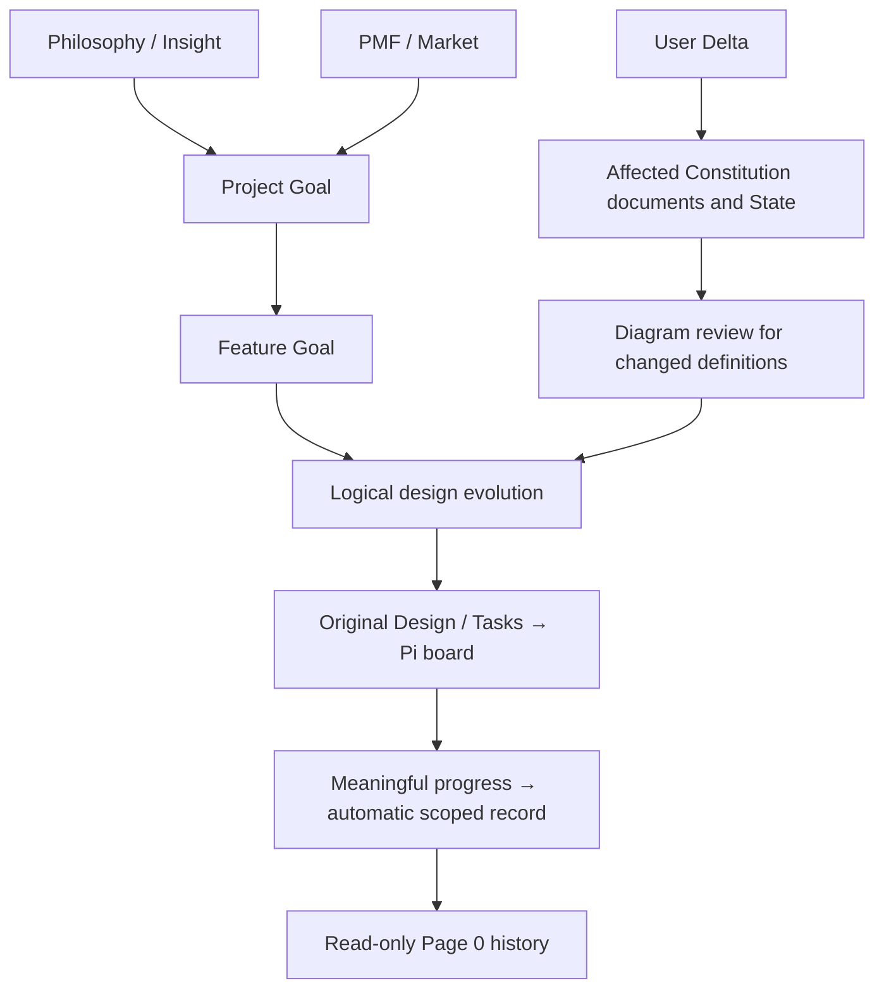

# Project Tracker

Use the installed `project-tracker` CLI. Never reimplement backend logic in
prompts. If missing, read [installation](references/installation.md); do not
fetch a latest package or install optional components implicitly.

## 入口：先让目标项目的上下文就绪

显式 `/skill:project-tracker` 默认扫描当前 Pi 会话所在的 Git 项目；也可以用
`/skill:project-tracker --project "项目路径" 后续要求`。路径相对会话目录解析，
绝不能相对 Tracker 安装目录解析。路径含空格时加引号；后续要求直接用中文。

核心安装包含配套 Pi 扩展。已加载时，扩展会在模型处理这次请求之前等待
`prepare --json --onboarding` 返回本次结果，校验编号、根目录和时间，并提供
`project-tracker-context` 消息中的有界证据及目标根目录。使用这次回执，
不要重复扫描或把历史回执当作本次成功。后续命令必须显式带上回执中的项目根目录。

- `ready` 且无后续要求：确认扫描完成，显示下面四项菜单；不自动展开进度总结。
- `needs_state_setup`：不是正常就绪。先按[项目接入](references/onboarding.md)评估已有 State、审图及备份选择；不执行原本的后续任务，不直接覆盖。
- `ready` 且有后续要求：直接继续原要求，不让用户再选一次。
- 扫描失败、读取不全或超时：停止这次后续操作，说明原因；不能用缓存报成功。
- 正在处理其他要求时，扩展先排队，空闲后再扫描；`/tracker-cancel` 取消扫描及队列。
- complete 只指扫描完整、上下文就绪，不指功能做完或检查通过。
- 扫描不执行任务或功能检查，也不写 `PROJECT_STATE.md`。

扫描成功后的菜单（无需重新输入 skill 命令，回复数字即可，也可以直接说需求）：

1. 看项目现状 — 进度、风险；按需追溯会话。
2. 更新项目记录 — 整理并保存已有事实，不强制运行检查。
3. 验证项目功能 — 运行检查，获取新的验证证据。
4. 打开项目页面 — 查看项目概览。

扩展只解释当前会话中紧接最近菜单的一次数字选择，绑定该菜单的项目，并在放行前
重新准备本次上下文。普通对话、新的 Tracker 调用、取消或切换会话使旧菜单失效；
`/reload` 后需要重新调用 skill。选择 2 不批准定义变更，但已有设计的例行进展自动保存；选择 3 不得绕过 allowlist；
选择 4 仍须核对目标项目，不宣称旧服务已经接通。

**仅加载 skill 文本的兼容路径没有程序级执行保证。** 如果本次没有配套扩展回执，
先简短说明自动入口未加载，再实际运行 `project-tracker prepare --json --onboarding [目标路径]`，
读取结果，按 ready 或 needs_state_setup 分支处理；不要回复“已启用，请选择操作”。CLI 不存在或失败时停止，
按[安装说明](references/installation.md)恢复本地入口。不要自行安装可选组件。

## Reporting

Before a substantive report of task understanding, design, or project progress,
automatically use the available `explain-with-diagrams` skill. Read its instructions
and let it choose the necessary diagram detail; simple results need no forced
diagram. Routine progress pings and tool outputs are not separate reports.

Follow [reporting policy](references/reporting.md) once per relevant report. If
the skill is unavailable, persist the report count in the project and offer to
install it on every fifth report (5, 10, 15, …), not on every invocation. Only
install after the user agrees. Declining or not answering never blocks the report
or Tracker work. This optional communication skill is independent of CodeGraph.

## Delivery flow

Read `PHILOSOPHY.md`, `MARKET.md`, `RULES.md`, the existing Constitution and State.
Derive Project Goal jointly from Philosophy / Insight and PMF / Market; milestones,
commits and existing code cannot supply it. Missing origins stay unknown; ask for
missing intent, never manufacture it. Rules constrain engineering, not goal origin.
Designs are evolution under one feature goal, not sibling deliverables. Use explicit
logical parents; `null` is unknown and `[]` an explicit root. Never infer ancestry
from Git, dates, filenames or ordering. Git only corroborates change and recovers
missed progress. Preserve original designs/tasks and human history.

A User Delta changes only relevant Constitution documents and State. Review changes
to goals, design definitions, ancestry, criteria or acceptance through diagrams.
Internal plans, JSON and raw diffs are not user approval gates. Use
[per-layer upstream reuse](references/layer-reuse.md): applicable OpenSpec and
Spec Kit functions can coexist; never choose one framework globally.

**Save routine development records automatically** to an existing design using
[state record](references/progress-recording.md). Record meaningful progress,
decisions, failed checks and blockers while developing, not only at the end or
on every message/commit. Do not ask the user to approve each append or wait for
an offline user. This authority does not cover definitions or acceptance.
Never directly edit `PROJECT_STATE.md`: use scoped record for progress and
[reviewed refresh](references/refresh.md) for structural updates.

For execution, use the configured open-source Pi board. Read
[Pi board execution](references/pi-board.md) before dispatch. The verified path
is a real single-shot `pi -p` task in a worktree, with output and exit status
returning to Review. Do not assume same-session follow-up or resume works.
Run current allowlisted verification and associate each acceptance criterion
with evidence that actually tests it. Task checkboxes do not prove acceptance.
Page 0 displays logical history, progress and Design Mark read-only; neither a
saved record, completed task, commit, merge nor board event proves acceptance.

## CLI operations

All project commands accept `[path]`, defaulting to the current directory.

下面是内部执行映射，不是调用后要展示的菜单。兼容旧英文操作参数，面向用户用中文说明。

| 用户原要求 | 扫描就绪后的处理 |
| --- | --- |
| 看项目现状 | 基于本次证据解释现状、冲突和时效；按需追溯相关会话，区分历史声称与当前事实，不写 State。 |
| 更新项目记录 | 已有设计的例行进展：按 [record](references/progress-recording.md) 自动追加。缺 verificationAllowlist 不阻止保存未验证事实，不强制先跑检查。定义/验收变化按 [refresh](references/refresh.md) 审图后保存；已有不兼容 State 按接入流程处理。 |
| 验证项目功能 | `project-tracker verify --json [path]`。缺配置时按[检查配置引导](references/onboarding.md)展示实际候选命令并询问创建；同意才保存/执行，拒绝则指导手动配置。配置错误不等于项目不适用。 |
| 打开项目页面 | `project-tracker dashboard --reuse [path]` 检查服务健康和目标根目录；成功后给出地址和停止方式。项目不符或无法验证时明确说明，不擅自重启既有服务。 |

Verification records are bound to project, HEAD and workspace content. Use only
current PASS evidence and only for the behavior tested. A changed workspace makes
older results stale. Verification alone does not refresh State. For refresh,
write dashboard-facing proposal prose in Simplified Chinese and plain language;
avoid implementation jargon, preserve machine enums and evidence IDs.

## Optional code navigation

Use `project-tracker map inspect [path]` when Map hints or runtime capability
are relevant; this read-only operation does not trigger an installation prompt.
Ordinary scan, refresh, dashboard and file/search work also do not prompt for
CodeGraph merely because it is absent.

Only when the task actually needs graph indexing or a graph context query
(`map index` / `map context`), check the selected runtime. If it is absent or
incomplete, explain the optional package, exact version, destination and command
from [installation](references/installation.md), then ask whether to install it.
Wait for explicit approval before installing the `codegraph` skill or runtime;
requesting Tracker work or code lookup is not installation approval. If the user
has declined for the current task, or has not answered, continue with Map hints
and ordinary file/search tools without asking again in that task. A later task
that actually needs graph functionality may ask again; absence alone is never
reason to repeat the offer.

When available, use the separate `codegraph` skill for bounded index/context
queries. Do not paste the entire graph into context or store project status in
the Map. Neither core installation nor ordinary status commands install CodeGraph.

## Evidence boundaries

Explicit marked project boundaries and user corrections outrank current
verification/filesystem facts, Git structure, and older assistant claims, in
that order. A commit proves code changed, not that behavior or production works.
Copy marked boundaries exactly into State proposals and keep status separate
from claim maturity. Error/aborted sessions are risks; abandoned branches are
historical context. Read [state schema](references/state-schema.md) for details.

Never read `.env`, credentials, or gitignored project data as evidence. The CLI
handles its own operational files and redacted verification records. Never run
verification outside the allowlist. Errors: `2` discovery, `3` validation,
`4` stale preview or writer conflict (`state_changed_since_preview`), `5` verification failed,
`6` incomplete preparation (no ready receipt).
